## Penicillins and β-Lactamase Inhibitors {background-color="#b20e10"}

 

   

**Russell E. Lewis**   Associate Professor of Infectious Diseases   Department of Molecular Medicine   University of Padua

::: {style="display: flex; justify-content: center; align-items: center; gap: 40px;"}
{width="150"} {width="250"}
:::

   russelledward.lewis\@unipd.it    [https://github.com/Russlewisbo](https://github.com/Russlewisbo/ESCMID_2022_talk)   Slides and course materials: [www.padovaid.com](https://padovaid.com/)

## Learning Objectives

 

**By the end of this lecture, you should be able to:**

1.  Describe the basic chemical structure of penicillins
2.  Explain how the side chain determines spectrum and stability
3.  Describe the mechanism of action involving PBPs
4.  Explain peptidoglycan synthesis and cross-linking
5.  List and explain the four mechanisms of β-lactam resistance
6.  Classify β-lactamases by Ambler molecular class
7.  Differentiate the five classes of penicillins by spectrum
8.  Describe pharmacokinetic properties and dosing adjustments
9.  Recognize adverse effects and hypersensitivity reactions
10. Select appropriate β-lactam/β-lactamase inhibitor combinations

# PART 1: History and chemistry {background-color="#b20e10"}

::: notes
We'll begin with the historical discovery and chemical basis of penicillins. Understanding structure is essential for understanding function.
:::

## The Discovery of penicillin

 

::::: columns
::: {.column width="60%"}
-   **September 1928**
-   Alexander Fleming at St. Mary's Hospital, London
-   Noticed bacterial lysis around *Penicillium* mold contamination
-   Published findings in 1929
-   Initially unable to purify the active compound
:::

::: {.column width="40%"}

:::
:::::

::: aside
Fleming was studying staphylococcal colonies when he noticed a contaminating mold had created a zone of bacterial inhibition. He named the antibacterial substance "penicillin" but couldn't purify it for clinical use.
:::

## From discovery to clinical use

   

| Year | Milestone                        |
|------|----------------------------------|
| 1928 | Fleming discovers penicillin     |
| 1929 | Fleming publishes findings       |
| 1940 | Florey & Chain purify penicillin |
| 1941 | First human treated              |
| 1943 | Mass production begins           |
| 1945 | Nobel Prize awarded              |

::: aside
The gap between discovery (1928) and clinical use (1941) was 13 years. Florey and Chain at Oxford developed the purification process. The first patient treated was a policeman with staphylococcal sepsis. Mass production was driven by WWII needs.
:::

## The Impact of penicillin

 

-   **Before penicillin**: Minor infections could be fatal
-   **Bacterial endocarditis**: 100% mortality
-   **Pneumococcal pneumonia**: 30% mortality
-   **Staphylococcal sepsis**: Often fatal
-   Penicillin transformed infectious disease medicine
-   Initiated the "antibiotic era"

::: notes
It's hard to overstate the impact. Diseases that were death sentences became curable. Surgery became safer. Emphasize that despite being nearly 100 years old, penicillins remain essential antibiotics.
:::

## Basic penicillin structure

 

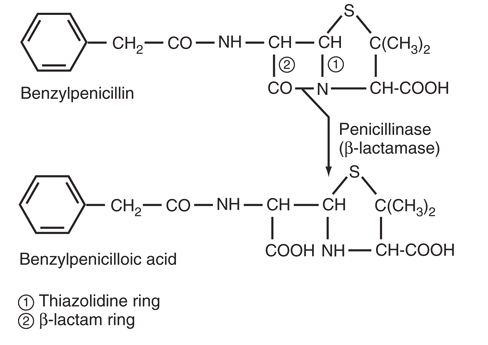{fig-align="center"}

::: aside
Thiazolidine ring (5-membered with sulfur), β-lactam ring (4-membered, essential for activity), and the side chain (R group). The carboxylic acid makes penicillins weak acids.
:::

## The three key structural components

 

1.  **Thiazolidine ring**
    -   5-membered ring containing sulfur
    -   Provides structural stability
2.  **β-Lactam ring**
    -   4-membered ring under strain
    -   ESSENTIAL for antibacterial activity
    -   Target of β-lactamases
3.  **Side chain (R group)**
    -   Variable component
    -   Determines properties of each penicillin

::: aside
The β-lactam ring is under considerable strain due to its geometry. This strain makes it reactive with PBPs but also susceptible to β-lactamase attack. The side chain is where all the modifications occur to create different penicillins.
:::

## The β-Lactam ring: Why it matters

 

::::: columns
::: {.column width="50%"}
-   **Strained 4-membered ring** — chemically reactive
-   **Mimics D-Ala-D-Ala** terminus of peptidoglycan
-   **Covalently binds** to PBP active site serine
-   **Opening the ring** = loss of activity
-   This is why β-lactamases cause resistance
:::

::: {.column width="50%"}
{fig-align="center" width="237"}
:::
:::::

::: callout-important
No β-lactam ring = No antibacterial activity
:::

::: aside
The β-lactam ring mimics the natural substrate of PBPs, which is the D-alanyl-D-alanine terminus of the peptidoglycan pentapeptide. When the ring opens (either by PBP binding or β-lactamase hydrolysis), the compound changes structure.
:::

## Classification of β-lactamases

 

::: {style="font-size: 0.75em"}
| **Ambler Class** | **Major Subtype** | **Preferred Substrates** | **Inhibitor** | **Genetic Localization** | **Representative Enzymes** |
|:----------:|------------|------------|------------|------------|------------|
| **A** | Gram-positive β-lactamase 2a | Penicillins | Clavulanic acid | Chromosome or plasmid | PC1 |
| **A** | **Gram-negative β-lactamase 2b** | Penicillins, 1st-gen cephalosporins | Clavulanic acid | Plasmid or chromosomal | TEM-1, SHV-1 |
| **A** | **Extended-spectrum β-lactamase 2be** | Penicillins, extended-spectrum cephalosporins, aztreonam | Clavulanic acid | Plasmid | TEM-24, SHV-12, CTX-M-15 |
| **A** | **Inhibitor-resistant TEM β-lactamase 2br** | Penicillins | Clavulanic acid^c^ | Plasmid | TEM-30, SHV-10 |
| **A** | **Carbenicillin-hydrolyzing β-lactamase 2c** | Carbenicillin | Clavulanic acid^c^ | Plasmid | PSE-1, CARB-3 |
| **A** | **Cephalosporin-hydrolyzing β-lactamase 2e** | Extended-spectrum cephalosporins | Clavulanic acid | Chromosome | CepA |
| **A** | **Carbapenem-hydrolyzing β-lactamase 2f** | Carbapenems | Avibactam, Relebactam, Vaborbactam | Chromosome or plasmid | KPC-2, SME-1 |
| **B** | Metallo-β-lactamase 3a | All β-lactams except monobactam | EDTA, divalent cation chelators | Chromosome or plasmid | IMP-1, VIM-2, NDM-1 |
| **C** | AmpC-type β-lactamase | Cephalosporins | Cloxacillin, avibactam, relebactam, vaborbactam | Chromosome or plasmid | AmpC, CMY-2 |
:::

## The side chain: Determining properties

 

The side chain modifications determine:

-   **Acid stability** — Can it survive gastric acid? (oral absorption)
-   **β-Lactamase stability** — Is it protected from enzymatic destruction?
-   **Spectrum of activity** — Which bacteria are susceptible?
-   **Protein binding** — How much free drug is available?
-   **Tissue penetration** — Where does the drug distribute?
-   **Cross-reactivity** - Risk of allergies?

::: aside
All the different penicillin classes arise from different side chain modifications. A bulky side chain near the β-lactam ring provides steric protection against β-lactamases.
:::

## 6-Aminopenicillanic Acid (6-APA)

 

::::: columns
::: {.column width="50%"}
-   The **penicillin nucleus** (core structure without side chain)
-   Isolated from *Penicillium chrysogenum* fermentation
-   Allowed creation of **semisynthetic penicillins**
-   Enabled systematic modification of the side chain
-   Led to development of all modern penicillins
:::

::: {.column width="50%"}
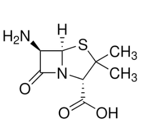
:::
:::::

::: notes
The isolation of 6-APA was a breakthrough. By attaching different side chains to this nucleus, chemists could create penicillins with different properties. This is how we got methicillin, ampicillin, and all the other semisynthetic penicillins.
:::

# PART 2: Mechanism of Action {background-color="#b20e10"}

::: notes
Now we'll explore how penicillins actually kill bacteria. Understanding the mechanism helps explain why they're bactericidal and why certain bacteria are resistant.
:::

## Overview: How penicillins work

 

:::::: columns
:::: {.column width="40%"}
-   Target: Final step of peptidoglycan synthesis
-   Mechanism: Penicillins inhibit bacterial cell wall synthesis by binding to penicillin-binding proteins (PBPs)
-   Result: Weakened cell wall
-   Outcome: Osmotic lysis and cell death
-   Effect: **Bactericidal** (kills bacteria)

::: aside
Penicillins are bactericidal, not bacteriostatic. However, they only kill actively growing bacteria that are synthesizing new cell wall.   Dormant bacteria (persister cells) can survive penicillin treatment.
:::
::::

::: {.column width="60%"}
<video src="images-betalactam1/pcn_moa.mov" controls autoplay muted playsinline style="width:100%; height:auto;">

</video>
:::
::::::

------------------------------------------------------------------------

## Why bacteria need cell walls

 

::::: columns
::: {.column width="50%"}
-   Bacteria have **high internal osmotic pressure**
-   Without cell wall → osmotic lysis
-   Cell wall = **peptidoglycan polymer**
-   Gram-positive: thick layer (50-100 molecules)
-   Gram-negative: thin layer (1-2 molecules) + outer membrane
-   **Human cells have no cell wall** → selective toxicity
:::

::: {.column width="50%"}
<video src="images-betalactam1/osmotic.mov" controls autoplay muted playsinline style="width:100%; height:auto;">

</video>
:::
:::::

::: aside
This is why penicillins have such a good safety profile. They target a structure (peptidoglycan) that human cells don't have. The selective toxicity ratio is excellent. Video source: <https://pdb101.rcsb.org/>
:::

------------------------------------------------------------------------

## Peptidoglycan structure

 

-   **Backbone**: Alternating NAG-NAM disaccharides
    -   NAG = N-acetylglucosamine
    -   NAM = N-acetylmuramic acid
-   **Pentapeptide stems**: Attached to NAM
    -   Terminate in D-Ala-D-Ala
-   **Cross-links**: Connect adjacent chains
    -   Provide strength and rigidity

::: notes
The cross-links are what give peptidoglycan its strength. Without cross-linking, the cell wall is weak and the bacterium lyses. This is exactly what penicillins prevent.
:::

## Transpeptidation: The target reaction

 

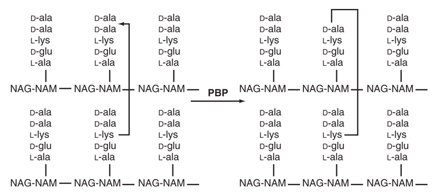{fig-align="center" width="600"}

1.  Pentapeptide ends in **D-Ala-D-Ala**
2.  Transpeptidase (PBP) binds to D-Ala-D-Ala
3.  Forms **covalent intermediate** with penultimate D-Ala
4.  Terminal D-Ala is released
5.  Cross-link formed with adjacent chain
6.  **Penicillin mimics D-Ala-D-Ala** and gets stuck

::: aside
Penicillin structurally mimics the D-Ala-D-Ala substrate. When the PBP tries to bind penicillin, it forms a stable covalent complex instead of completing the reaction. The enzyme is "stuck."
:::

------------------------------------------------------------------------

## What are penicillin-binding proteins (PBPs)?

 

-   **Membrane-bound enzymes** in all bacteria
-   Catalyze final steps of cell wall synthesis
-   **Serine proteases** — related to β-lactamases!
-   Named for their ability to bind penicillin
-   Multiple PBPs in each bacterial species
-   Different PBPs have different functions

::: aside
The evolutionary relationship between PBPs and β-lactamases is important. β-lactamases evolved from PBPs but developed the ability to rapidly hydrolyze (rather than be inhibited by) β-lactams.
:::

------------------------------------------------------------------------

## Classes of PBPs

   

:::: {style="display: flex; justify-content: center;"}
::: {style="width: 65%;"}
| Class | Size | Function |
|------------------------|------------------------|------------------------|
| **High-MW Class A** | \>50 kDa | Bifunctional: transglycosylase + transpeptidase |
| **High-MW Class B** | \>50 kDa | Transpeptidase only |
| **Low-MW** | \<50 kDa | Carboxypeptidases |
:::
::::

::: aside
High-molecular-weight PBPs are the essential targets. Class A PBPs can do both glycan chain elongation and cross-linking. Class B only do cross-linking. Low-MW PBPs are carboxypeptidases that trim the peptidoglycan.
:::

------------------------------------------------------------------------

## PBP functions in *E. coli*

 

:::: {style="display: flex; justify-content: center;"}
::: {style="width: 65%;"}
| PBP      | Function                          | Inhibition result   |
|----------|-----------------------------------|---------------------|
| PBP1a/1b | Transglycosylase + transpeptidase | Rapid cell lysis    |
| PBP2     | Cell elongation, rod shape        | Round cells (cocci) |
| PBP3     | Septum formation, cell division   | Long filaments      |
| PBP4-6   | Carboxypeptidases                 | Minor effects       |
:::
::::

::: aside
Different β-lactams have different affinities for different PBPs, which explains why some cause rapid lysis while others cause filamentation. The essential PBPs are 1, 2, and 3.
:::

------------------------------------------------------------------------

## PBPs vs β-Lactamases: Key difference

 

::::: columns
::: {.column width="50%" style="text-align: center;"}
**PBPs (Cell Wall Synthesis)**

-   Bind penicillin tightly
-   **Slow deacylation** rate
-   Enzyme stays inhibited
-   = Antibacterial effect
:::

::: {.column width="50%" style="text-align: center;"}
**β-Lactamases (Resistance)**

-   Bind penicillin
-   **Fast deacylation** rate
-   Enzyme regenerates quickly
-   = Drug destruction
:::
:::::

::: notes
This is the crucial biochemical distinction. Both enzymes bind penicillin via an active-site serine. The difference is how fast they release it. PBPs hold on (inhibition); β-lactamases let go quickly (resistance).
:::

## Tolerance vs Resistance

::::: columns
::: {.column width="50%"}
-   **Resistance**: Bacteria grow in presence of antibiotic
    -   MIC is high
-   **Tolerance**: Bacteria survive but don't grow
    -   MIC is low (susceptible)
    -   MBC is high (not killed)
    -   Examples: stationary phase cells, persisters in biofilm
:::

::: {.column width="50%"}
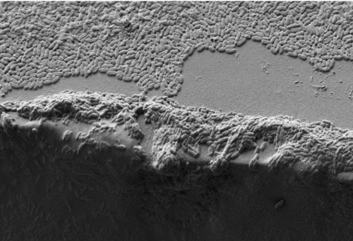{fig-align="center"}
:::
:::::

 

::: callout-tip
Tolerance explains why some infections relapse despite "susceptible" organisms
:::

::: aside
This distinction is important clinically. A "susceptible" organism may still cause treatment failure if many cells are tolerant (not actively growing). This is relevant for endocarditis and other difficult infections.
:::

# PART 3: Resistance Mechanisms {background-color="#b20e10"}

## Four mechanisms of β-Lactam resistance

 

1.  **β-Lactamase production** — enzymatic destruction
2.  **Decreased permeability** — porin mutations
3.  **Efflux pumps** — active drug removal
4.  **Altered PBPs** — low-affinity binding

::: callout-warning
Multiple mechanisms often coexist, especially in MDR gram-negatives
:::

## Mechanism 1: β-Lactamases

 

-   **Most common resistance mechanism**
-   Enzymes that hydrolyze the β-lactam ring
-   Open the ring → inactive compound
-   **Gram-positive**: Secreted extracellularly
-   **Gram-negative**: Located in periplasmic space
-   Can be chromosomal or plasmid-encoded

::: aside
The location matters. In gram-negatives, β-lactamases are concentrated in the periplasm where they can intercept drugs before they reach PBPs. In gram-positives, they're secreted and protect nearby bacteria too.
:::

## β-Lactamase mechanism

::::: columns
::: {.column width="50%"}
<video src="images-betalactam1/betalactamase.mov" controls autoplay muted playsinline style="width:100%; height:auto;">

</video>
:::

::: {.column width="50%"}
1.  β-Lactamase binds penicillin (like a PBP)
2.  Forms acyl-enzyme intermediate
3.  **Rapid hydrolysis** — water attacks the bond
4.  Ring opens, releasing penicilloic acid
5.  Enzyme regenerates immediately
6.  Cycle repeats (catalytic)
:::
:::::

::: aside
One β-lactamase molecule can destroy thousands of penicillin molecules. This is why even low levels of β-lactamase can cause resistance. The key is the fast deacylation rate compared to PBPs. Video source: <https://pdb101.rcsb.org/>
:::

## Ambler classification of β-Lactamases

 

| Class | Active Site    | Mechanism         | Examples             |
|-------|----------------|-------------------|----------------------|
| **A** | Serine         | Acyl intermediate | TEM, SHV, CTX-M, KPC |
| **B** | Zinc (metallo) | Direct hydrolysis | NDM, VIM, IMP        |
| **C** | Serine         | Acyl intermediate | AmpC, CMY            |
| **D** | Serine         | Acyl intermediate | OXA enzymes          |

::: aside
The Ambler classification is based on amino acid sequence. Classes A, C, D are serine enzymes (evolved from PBPs). Class B uses zinc ions and has a completely different mechanism. This matters for inhibitor selection.
:::

## Class A β-Lactamases: The most common

 

-   **TEM-1**: Most common plasmid enzyme worldwide
-   **SHV-1**: Common in *Klebsiella*
-   **CTX-M**: Dominant ESBL globally
-   **KPC**: Carbapenemase (major threat)
-   Generally **inhibited by clavulanic acid**
-   Exception: KPC (not well inhibited)

::: aside
TEM-1 was one of the first plasmid-encoded β-lactamases discovered. CTX-M-15 has become the dominant ESBL worldwide over the past 20 years. KPC is concerning because it hydrolyzes carbapenems.
:::

## Extended-Spectrum β-Lactamases (ESBLs)

 

-   **Definition**: Class A enzymes that hydrolyze extended-spectrum cephalosporins and aztreonam
-   **Evolution**: Point mutations in TEM/SHV expanded spectrum
-   **CTX-M family**: Now most common ESBL
-   **Inhibited by clavulanic acid** (in vitro)
-   **Plasmid-encoded** — spread easily

::: callout-warning
Clinical outcomes with BLI combinations may be unpredictable for serious ESBL infections
:::

::: notes
ESBLs arose from mutations in TEM and SHV that expanded their substrate range. CTX-M enzymes are a separate family. Despite in vitro inhibition by clavulanic acid, treatment failures occur with serious infections.
:::

## Class B: Metallo-β-Lactamases (MBLs)

 

-   **Use zinc ions** instead of serine
-   Hydrolyze **all β-lactams EXCEPT aztreonam**
-   **NOT inhibited** by current approved inhibitors
-   Examples: NDM-1, VIM, IMP
-   Major global health threat
-   Limited treatment options

::: callout-important
The "aztreonam loophole" — MBLs cannot hydrolyze monobactams
:::

::: aside
NDM (New Delhi metallo-β-lactamase) is spreading globally. The lack of effective inhibitors is a major problem. The aztreonam exception is being exploited clinically (aztreonam + avibactam combinations).
:::

## Class C: AmpC β-Lactamases

 

-   **Cephalosporinases** — preferentially hydrolyze cephalosporins

-   Often **chromosomally encoded**

-   Can be **inducible** (expressed when exposed to β-lactams)

-   **Classic "SPACE" organisms:** *Serratia, Pseudomonas, Acinetobacter, Citrobacter, Enterobacter*

-   **Revised "HECK-YES" organisms:** *Hafnia, Enterobacter, Citrobacter (freundii complex), Klebsiella (aerogenes), Yersinia, Enterobacter, Serratia*

-   **NOT inhibited** by clavulanic acid

-   Inhibited by avibactam, relebactam, vaborbactam

::: aside
The SPACE organisms have inducible chromosomal AmpC. However, the SPACE mnemonic is overly broad and partly incorrect as not all listed organisms have clinically relevant inducible AmpC. It lumps together organisms with very different resistance risks and it leads to overtreatment (e.g., unnecessary carbapenems). The "HECK-YES" organisms have clinically meaningful inducible chromosomal AmpC β-lactamases. Exposure to certain β-lactams (e.g., ceftazidime) can induce high-level expression. Cefepime is more stable to AmpC hydrolysis than ceftriaxone.
:::

## Class D: OXA enzymes

 

-   Named for ability to hydrolyze **oxacillin**
-   Heterogeneous group with variable spectra
-   Some are **carbapenemases** (OXA-48, OXA-23)
-   OXA-48: Poorly inhibited by most inhibitors
    -   Exception: Avibactam inhibits OXA-48
-   Increasingly important in *Acinetobacter* (OXA-23)

::: notes
OXA-48 is a challenging enzyme because it doesn't dramatically elevate MICs to carbapenems but does cause clinical failures. It's important in *K. pneumoniae* in certain geographic areas.
:::

## Carbapenemases: The greatest threat

 

| Enzyme | Class | Distribution        | Inhibitors                         |
|--------|-------|---------------------|------------------------------------|
| KPC    | A     | Americas, worldwide | Avibactam, vaborbactam, relebactam |
| NDM    | B     | South Asia, global  | None currently approved            |
| VIM    | B     | Europe, global      | None currently pproved             |
| OXA-48 | D     | Middle East, Europe | Avibactam                          |

::: notes
Carbapenemases compromise our "last-resort" antibiotics. Geographic distribution varies. KPC is most common in the US. NDM is dominant in South Asia. Treatment options are limited.
:::

## Mechanism 2: Decreased permeability

 

::::: columns
::: {.column width="50%"}
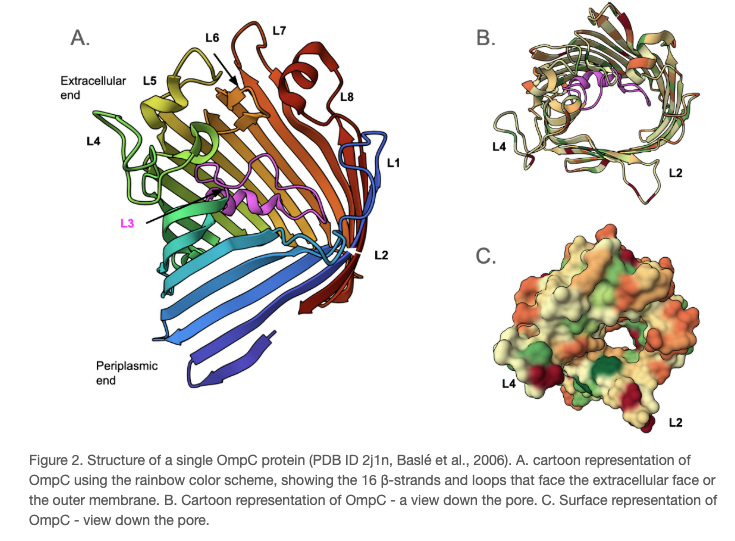
:::

::: {.column width="50%"}
-   Relevant only for **gram-negative bacteria**
-   Outer membrane = barrier to drug entry
-   **Porins** = channels for drug entry
-   Porin mutations/loss → reduced drug entry
-   Common in *Pseudomonas aeruginosa*
    -   OprD loss → carbapenem resistance
:::
:::::

::: notes
The gram-negative outer membrane is an additional barrier. Drugs must pass through porin channels. Loss or modification of porins reduces drug accumulation. This alone usually causes low-level resistance.Image source: <https://pdb101.rcsb.org/>
:::

## Mechanism 3: Efflux Pumps

 

::::: columns
::: {.column width="50%"}
-   **Active transport** of drugs out of the cell
-   Use energy (proton motive force or ATP)
-   Can be **constitutive or inducible**
-   Often have **broad substrate specificity**
-   Example: MexAB-OprM in *P. aeruginosa*
-   Contribute to **multidrug resistance**
:::

::: {.column width="50%"}
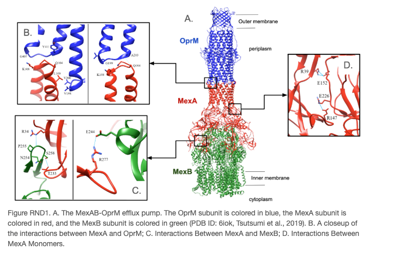{fig-align="center"}
:::
:::::

::: notes
Efflux pumps often work with other mechanisms. In *Pseudomonas*, efflux + β-lactamases + porin loss creates high-level resistance. Efflux pumps can affect multiple drug classes simultaneously. Image source: <https://pdb101.rcsb.org/>
:::

## Mechanism 4: Altered PBPs

 

::::: columns
::: {.column width="50%"}
-   PBPs with **low affinity** for β-lactams
-   Drug binds poorly → ineffective inhibition
-   Examples:
    -   **MRSA**: Acquires PBP2a (mecA gene)
    -   **Penicillin-resistant pneumococci**: Mosaic PBP genes
    -   **Enterococcus faecium**: Low-affinity PBP5
:::

::: {.column width="50%"}
<video src="images-betalactam1/alteredpbp.mov" controls autoplay muted playsinline data-autoplay style="width:100%; height:auto;">

</video>
:::
:::::

::: callout-important
MRSA resistance is NOT due to β-lactamases — it's due to PBP2a
:::

::: aside
This is a critical concept. MRSA produces a novel PBP (PBP2a) with very low affinity for most β-lactams. No amount of β-lactamase inhibitor will help. That's why MRSA requires different antibiotics.Video source: <https://pdb101.rcsb.org/>
:::

## MRSA: Mechanism of resistance

 

1.  MRSA carries **mecA gene** (on SCCmec element)
2.  mecA encodes **PBP2a** (also called PBP2')
3.  PBP2a has **very low affinity** for β-lactams
4.  Native PBPs are inhibited, but PBP2a continues working
5.  Cell wall synthesis continues
6.  **All β-lactams ineffective** (except ceftaroline, ceftobiprole)

::: aside
This mechanism explains why we need different drugs for MRSA. The newer cephalosporins ceftaroline and ceftobiprole have enhanced binding to PBP2a, which is why they're active against MRSA.
:::

# PART 4: Classification of Penicillins {background-color="#b20e10"}

::: notes
Now we'll classify penicillins by their antibacterial spectrum. Understanding the classes helps with drug selection.
:::

## Five classes of penicillins

 

1.  **Natural penicillins** — Penicillin G, Penicillin V
2.  **Penicillinase-resistant** — Nafcillin, Oxacillin, Dicloxacillin
3.  **Aminopenicillins** — Ampicillin, Amoxicillin
4.  **Carboxypenicillins** — Ticarcillin (obsolete)
5.  **Ureidopenicillins** — Piperacillin

::: notes
Each class has different side chain modifications. The modifications determine spectrum, stability, and pharmacokinetics. We'll discuss each class in detail.
:::

## Class 1: Natural penicillins

 

::::: columns
::: {.column width="50%"}
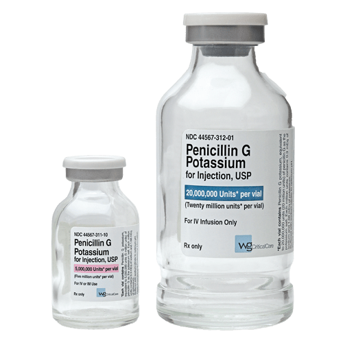{fig-align="center" width="250"}
:::

::: {.column width="50%"}
**Penicillin G** (parenteral) and **Penicillin V** (oral)

-   The original penicillins
-   **Narrowest spectrum** but highest potency against susceptible organisms
-   **Acid-labile** (Pen G) vs **Acid-stable** (Pen V)
-   Susceptible to β-lactamases
-   Still drugs of choice for many infections
:::
:::::

## Natural Penicillins: Spectrum

 

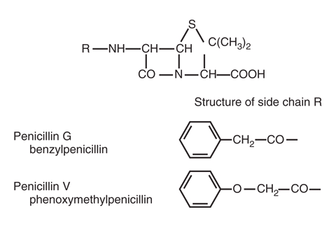{fig-align="center"}

**Excellent activity:**

-   *Streptococcus pyogenes* (Group A strep)
-   *Streptococcus agalactiae* (Group B strep)
-   *Streptococcus pneumoniae* (susceptible strains)
-   *Neisseria meningitidis*
-   *Treponema pallidum* (syphilis)
-   Most oral anaerobes
-   *Listeria monocytogenes*

::: notes
Group A strep has essentially 100% susceptibility to penicillin. Penicillin G remains first-line for syphilis. These are important "penicillin G diseases" to remember.
:::

## Natural Penicillins: Clinical uses

 

| Infection                       | Drug of Choice  |
|---------------------------------|-----------------|
| Group A strep pharyngitis       | Penicillin V    |
| Syphilis (all stages)           | Penicillin G    |
| Neurosyphilis                   | IV Penicillin G |
| Meningococcal meningitis        | Penicillin G    |
| Actinomycosis                   | Penicillin G    |
| Gas gangrene (*C. perfringens*) | Penicillin G    |

::: aside
These are infections where natural penicillins remain preferred.  For syphilis, penicillin G is still the drug of choice alhough outcomes may be similar with ceftriazone.   Penicillin-allergic patients with syphilis should undergo desensitization.
:::

## Class 2: Penicillinase-resistant penicillins

 

::::: columns
::: {.column width="50%"}
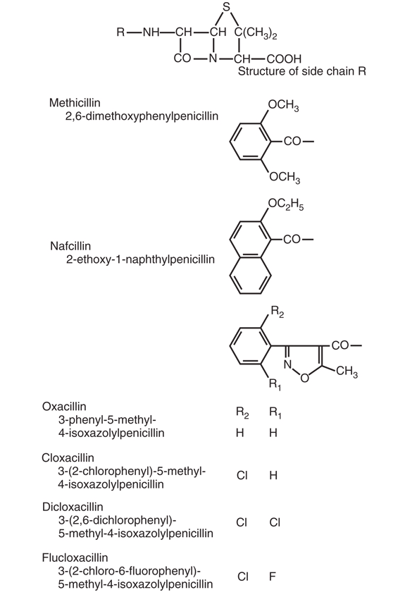{fig-align="center" width="350"}
:::

::: {.column width="50%"}
**Nafcillin, Oxacillin, Dicloxacillin, Flucloxacillin**

-   **Bulky side chains** create steric hindrance
-   Resist hydrolysis by staphylococcal β-lactamases
-   Spectrum: **MSSA and streptococci**
-   No gram-negative activity
-   **NOT effective against MRSA**
:::
:::::

   

::: aside
The bulky side chain physically blocks β-lactamase access to the β-lactam ring. Remember: they don't work against MRSA because MRSA resistance is PBP-mediated, not β-lactamase-mediated.
:::

## Antistaphylococcal penicillins: Details

 

| Drug           | Route | Protein Binding | Elimination   | Special Considerations  |
|---------------|---------------|---------------|---------------|---------------|
| Nafcillin      | IV    | 90%             | Hepatic       | Hypokalemia, phlebitis  |
| Oxacillin      | IV    | 90%             | Mixed         | Hepatotoxicity          |
| Dicloxacillin  | PO    | 96%             | Renal/hepatic | Highest protein binding |
| Flucloxacillin | PO/IV | 96%             | Renal         | Not available in US     |

::: notes
Nafcillin is primarily hepatically eliminated, so no renal dose adjustment needed.  Oxacillin can cause hepatotoxicity. Dicloxacillin has the highest protein binding of any penicillin.
:::

## Class 3: Aminopenicillins

 

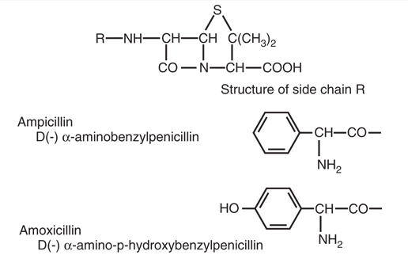{fig-align="center" width="600"}

 

::: aside
The amino group on the side chain improves penetration through gram-negative outer membranes.  Amoxicillin's hydroxyl group improves oral absorption. Both are susceptible to β-lactamases.
:::

## Aminopenicillins: Expanded spectrum

 

-   **Same as natural penicillins PLUS:**
    -   *Enterococcus faecalis*
    -   *Haemophilus influenzae* (non-β-lactamase producing)
    -   *Escherichia coli* (non-β-lactamase producing)
    -   *Proteus mirabilis*
    -   *Salmonella* and *Shigella* spp.
    -   *Listeria monocytogenes*

::: aside
The expanded gram-negative coverage is useful but limited by β-lactamase production.   Many *E. coli* are now resistant due to β-lactamases. Enterococcal coverage makes ampicillin important for certain infections.
:::

## Ampicillin vs amoxicillin

 

| Property        | Ampicillin | Amoxicillin            |
|-----------------|------------|------------------------|
| Oral absorption | 30-55%     | 74-92%                 |
| Effect of food  | Decreased  | None                   |
| Preferred route | IV         | Oral                   |
| Bioequivalence  | —          | Better than ampicillin |

   

:::: {style="width: fit-content; margin: auto;"}
::: callout-tip
For oral therapy, amoxicillin is almost always preferred
:::
::::

::: aside
Oral amoxicillin achieves much better levels than oral ampicillin.   Unless IV is needed, amoxicillin is the better choice.
:::

## Classes 4 & 5: Antipseudomonal penicillins

 

::::: columns
::: {.column width="50%"}
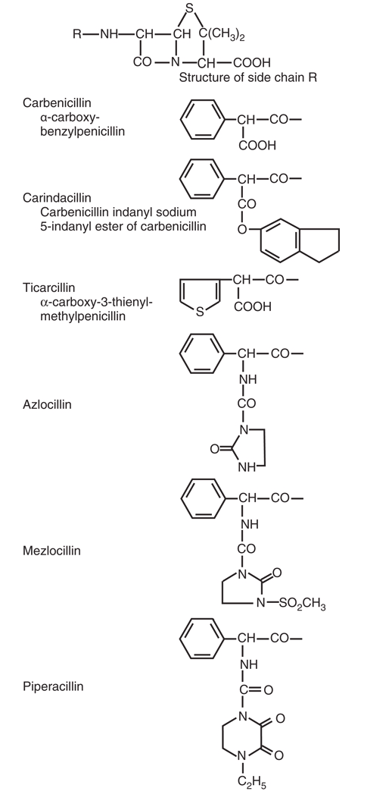{fig-align="center" width="300"}
:::

::: {.column width="50%"}
**Carboxypenicillins** (ticarcillin) — largely obsolete **Ureidopenicillins** (piperacillin) — in wide use

-   Extended gram-negative spectrum
-   Activity against *Pseudomonas aeruginosa*
-   Excellent anaerobic coverage
-   Susceptible to β-lactamases
-   Now used with β-lactamase inhibitors
:::
:::::

## Spectrum summary table

 

::: {style="width: fit-content; margin: auto;"}
| Class              | Gram+      | Gram- | Pseudomonas | Anaerobes | MRSA |
|--------------------|------------|-------|-------------|-----------|------|
| Natural            | +++        | \-    | \-          | ++        | \-   |
| Antistaphylococcal | ++ (Staph) | \-    | \-          | \-        | \-   |
| Aminopenicillins   | ++         | \+    | \-          | ++        | \-   |
| Antipseudomonal    | \+         | ++    | ++          | +++       | \-   |
:::

::: aside
This summary helps with quick selection. Note that NONE of the penicillins work against MRSA.   Antistaphylococcal penicillins are narrow but highly effective against MSSA.
:::

# PART 5: Pharmacokinetics {background-color="#b20e10"}

## Oral absorption

 

| Penicillin     | Absorption (%) | Food Effect |
|----------------|----------------|-------------|
| Penicillin V   | 60             | None        |
| Ampicillin     | 30-55          | Decreased   |
| Amoxicillin    | 74-92          | None        |
| Dicloxacillin  | 37             | Decreased   |
| Flucloxacillin | 44             | Decreased   |

    :::{style="width: fit-content; margin: auto;"} ::: {.callout-tip} Amoxicillin has the best oral bioavailability ::: :::

::: aside
Absorption varies dramatically. This determines which penicillins can be used orally.   Amoxicillin is exceptional with 74-92% absorption unaffected by food. Lower doses (e.g., 250–500 mg)→ High bioavailability (\~85–95%), fairly linear but with higher doses (e.g., ≥1000 mg)→ Reduced fractional absorption (bioavailability drops to \~60–70%)→ but total exposure still increases, but less than dose-proportional.     Most others oral peneicllins should be taken on an empty stomach.
:::

## Protein binding

 

-   Ranges from **17% (aminopenicillins) to 97% (dicloxacillin)**
-   **Only free drug is active**
-   High protein binding:
    -   Reduces active drug concentration
    -   Prolongs half-life
    -   May reduce tissue penetration
-   Clinical significance debated

::: aside
Protein binding affects interpretation of serum levels. A drug with 96% protein binding has only 4% free drug.   Whether this is clinically significant is debated, but it may matter for deep-seated infections.
:::

## Distribution

 

-   Generally **good tissue penetration**
-   Achieve therapeutic levels in:
    -   Lung, liver, kidney, muscle
    -   Pleural, peritoneal, synovial fluid
    -   Bone (variable)
-   **Poor penetration without inflammation**:
    -   CNS, eye, prostate

::: aside
Penicillins are polar molecules with limited lipid solubility. They distribute well to most tissues but penetrate the CNS poorly. Inflammation increases CNS penetration (important for meningitis treatment).
:::

## CNS Penetration

 

| Condition         | Penicillin G | Ampicillin |
|-------------------|--------------|------------|
| Normal meninges   | \<1%         | \<1%       |
| Inflamed meninges | 5-10%        | 13-14%     |

   

:::: {style="width: fit-content; margin: auto;"}
::: callout-note
Inflammation is required for adequate CNS levels. As meningitis resolves, drug penetration decreases.
:::
::::

::: aside
This has clinical implications. Meningitis treatment requires high doses because penetration is still limited even with inflammation. As treatment succeeds and inflammation decreases, drug levels in CSF decrease too.
:::

## Elimination

 

-   **Most penicillins**: Primarily renal excretion
    -   Glomerular filtration + tubular secretion
    -   Short half-lives (0.5-1.5 hours)
    -   Probenecid can block tubular secretion
-   **Exceptions**:
    -   Nafcillin: Primarily hepatic
    -   Oxacillin: Mixed hepatic/renal

::: aside
The short half-lives necessitate frequent dosing (every 4-6 hours).   Renal impairment requires dose adjustment for most penicillins. Nafcillin is the exception—no renal adjustment needed.
:::

## Renal dosing: When to adjust

 

| CrCl (mL/min) | Adjustment Needed?         |
|---------------|----------------------------|
| \>50          | Usually no                 |
| 30-50         | Consider for some agents   |
| 10-30         | Yes for most agents        |
| \<10          | Yes, significant reduction |
| Hemodialysis  | Dose after dialysis        |

::: aside
The threshold for dose adjustment varies by agent. Natural penicillins and aminopenicillins need adjustment below 30 mL/min. Antistaphylococcal penicillins (except oxacillin) generally don't need adjustment.
:::

## Dosing in renal failure

 

| Agent        | CrCl 10-29  | Hemodialysis   |
|--------------|-------------|----------------|
| Penicillin G | 75% dose    | Dose post-HD   |
| Ampicillin   | 0.5-2g q12h | 0.5-1g q12-24h |
| Amoxicillin  | 500mg q12h  | 500mg q12-24h  |
| Piperacillin | 3g q8-12h   | 3g q12h        |
| Nafcillin    | No change   | No change      |

::: notes
Nafcillin doesn't require renal adjustment. For dialysis patients, give the dose after dialysis to avoid drug removal.   Extended-spectrum agents like piperacillin require adjustment.
:::

## Optimizing β-Lactam dosing

 

-   β-Lactams are **time-dependent killers**
-   Efficacy correlates with **%T\>MIC** (time above MIC)
-   Target: 40-70% of dosing interval above MIC
-   Strategies to optimize:
    -   More frequent dosing
    -   Extended infusions (3-4 hours)
    -   Continuous infusions

::: aside
This PK/PD concept is fundamental. Unlike aminoglycosides (concentration-dependent), β-lactams need to maintain levels above MIC for as long as possible. Extended infusions are now standard for piperacillin-tazobactam.
:::

## Extended infusion dosing

 

**Example:** Piperacillin-tazobactam

| Traditional               | Extended Infusion         |
|---------------------------|---------------------------|
| 4.5g over 30 min q6h      | 4.5g over 4 hours q8h     |
| Higher peak, lower trough | Lower peak, higher trough |
| Less time above MIC       | More time above MIC       |

   

::: callout-tip
Extended infusion may improve outcomes, especially for organisms with higher MICs
:::

::: aside
Extended infusion dosing has become standard of care in many institutions. The total daily dose may be similar or even lower, but the pharmacodynamics are superior.
:::

# PART 6: Adverse effects {background-color="#b20e10"}

## Overview of adverse effects

 

-   **Hypersensitivity reactions** — most important
-   Gastrointestinal effects
-   Hematologic effects
-   Neurologic effects
-   Nephrotoxicity
-   Hepatotoxicity
-   Electrolyte disturbances

::: aside
Hypersensitivity is the most clinically significant concern.   Most other effects are dose-related or specific to certain agents.
:::

## Hypersensitivity: Types

 

| Type | Timing | Mechanism | Manifestations |
|------------------|------------------|------------------|------------------|
| Type I | Minutes-hours | IgE-mediated | Anaphylaxis, urticaria, angioedema |
| Type II | Days | Antibody-mediated | Hemolytic anemia, cytopenia |
| Type III | 1-3 weeks | Immune complex | Serum sickness, drug fever |
| Type IV | Days-weeks | T-cell mediated | Maculopapular rash, contact dermatitis |

   

::: aside
Type I reactions are the most dangerous and require avoidance. Type IV reactions (delayed maculopapular rashes) are most common and generally don't preclude future use.
:::

## Penicillin allergy: By the numbers

 

-   **\~10%** of patients report penicillin allergy
-   **\<1%** have true IgE-mediated allergy when tested
-   **\~2%** will react if challenged
-   **True anaphylaxis: \<0.01%**
-   Allergy often wanes over time
    -   50% lose sensitivity within 5 years
    -   80% lose sensitivity within 10 years

::: aside
These numbers are important. Most "penicillin allergy" labels are inaccurate. Over-labeling leads to use of broader-spectrum, more toxic, and more expensive antibiotics. De-labeling is an important intervention.
:::

## Penicillin allergy de-labeling

 

1.  **History assessment** — Was it really an allergic reaction?
2.  **Risk stratification** — High risk vs low risk features
3.  **Skin testing** — Detects IgE-mediated allergy
4.  **Graded oral challenge** — Confirms tolerance
5.  **Update medical record** — Remove incorrect allergy label

   

::: callout-tip
De-labeling programs are safe and improve patient care
:::

::: aside
Penicillin allergy de-labeling is an important quality improvement initiative. Many patients can safely receive penicillins after proper evaluation. This improves outcomes and reduces costs.
:::

## Cross-reactivity with cephalosporins

 

-   **Historical estimates**: 10% cross-reactivity (overestimate)
-   **Current data**: \~1-2% cross-reactivity
-   Cross-reactivity relates to **side chain similarity**
-   Highest risk: Similar R1 side chains
    -   Ampicillin → Cephalexin, Cefadroxil
-   Lower risk: Dissimilar side chains
    -   Ceftriaxone, cefepime

::: notes
The 10% cross-reactivity rate was based on flawed data. Current evidence suggests much lower rates. Side chain similarity predicts cross-reactivity better than the β-lactam ring alone.
:::

## Other adverse effects

 

| Effect | Most Common With | Notes |
|----|----|----|
| Diarrhea | Ampicillin, amoxicillin-clav | Disruption of gut flora |
| *C. difficile* | All | Risk with any antibiotic |
| Neutropenia | Prolonged high-dose therapy | Reversible |
| Seizures | High-dose penicillin G | Especially in renal failure |
| Interstitial nephritis | Methicillin, nafcillin | Allergic mechanism |

::: notes
GI effects are common with oral penicillins. Neutropenia is associated with prolonged courses (\>2 weeks). Seizures occur with very high doses, especially in patients with renal impairment.
:::

## Agent-specific toxicities

 

-   **Nafcillin**: Hypokalemia, phlebitis
-   **Oxacillin**: Hepatotoxicity, interstitial nephritis
-   **Ampicillin**: Maculopapular rash (especially with EBV)
-   **Amoxicillin-clavulanate**: Diarrhea, hepatotoxicity
-   **Piperacillin**: Platelet dysfunction, hypokalemia
-   **High-dose Penicillin G (K+ salt)**: Hyperkalemia

::: aside
The ampicillin rash with infectious mononucleosis is not a true allergy and doesn't predict future reactions.   Piperacillin can cause platelet dysfunction with prolonged use.
:::

# PART 7: β-Lactamase inhibitors {background-color="#b20e10"}

## β-Lactamase inhibitor classes

 

::::: {.columns style="justify-content: center;"}
::: {.column width="40%" style="text-align: center;"}
**Traditional (β-lactam)**

-   Clavulanic acid
-   Sulbactam
-   Tazobactam
:::

::: {.column width="40%" style="text-align: center;"}
**Novel (non-β-lactam)**

-   Avibactam
-   Relebactam
-   Vaborbactam
:::
:::::

::: aside
The traditional inhibitors are β-lactam compounds themselves that act as "suicide substrates."   The novel inhibitors have different mechanisms and broader coverage, including KPC and AmpC.
:::

## Mechanism: Traditional inhibitors

 

1.  Inhibitor binds to β-lactamase active site
2.  Forms stable **acyl-enzyme complex**
3.  Complex undergoes **irreversible fragmentation**
4.  Enzyme is permanently inactivated
5.  "**Suicide inhibitor**" mechanism
6.  One inhibitor molecule = one enzyme molecule

::: notes
The traditional inhibitors sacrifice themselves to inactivate the β-lactamase. This is different from competitive inhibition—the enzyme is destroyed, not just temporarily blocked.
:::

## Traditional inhibitor combinations

 

| Inhibitor       | Partner      | Formulations |
|-----------------|--------------|--------------|
| Clavulanic acid | Amoxicillin  | Oral, IV     |
| Sulbactam       | Ampicillin   | IV           |
| Tazobactam      | Piperacillin | IV           |

::: aside
Sulbactam has intrinsic activity against *Acinetobacter*.   Tazobactam is always used with piperacillin.
:::

## Spectrum of traditional inhibitors

 

**Inhibited:**

-   Class A β-lactamases (TEM, SHV, many ESBLs)
-   *S. aureus* β-lactamase
-   *Bacteroides* β-lactamase

**NOT inhibited:**

-   Class B (metallo-β-lactamases)
-   Class C (AmpC)
-   KPC (weak inhibition)

::: aside
This is a critical limitation. Traditional inhibitors don't work against AmpC or carbapenemases. That's why piperacillin-tazobactam doesn't work reliably against AmpC-producing organisms or KPC producers.
:::

## Novel β-Lactamase inhibitors

 

| Inhibitor   | Partner     | Unique Feature             |
|-------------|-------------|----------------------------|
| Avibactam   | Ceftazidime | Inhibits KPC, OXA-48, AmpC |
| Relebactam  | Imipenem    | Inhibits KPC, AmpC         |
| Vaborbactam | Meropenem   | Inhibits KPC, AmpC         |

::: {.callout-important style="width: 60%; margin: auto;"}
None inhibit metallo-β-lactamases (NDM, VIM, IMP)
:::

::: aside
These newer combinations have expanded activity against carbapenemases and AmpC.   They're important for treating CRE. However, the gap remains for metallo-β-lactamases.
:::

## Inhibitor spectrum summary

 

| Inhibitor   | Class A | ESBLs | KPC | AmpC | MBLs | OXA-48 |
|-------------|---------|-------|-----|------|------|--------|
| Clavulanate | ✓       | ±     | ✗   | ✗    | ✗    | ✗      |
| Tazobactam  | ✓       | ±     | ✗   | ✗    | ✗    | ✗      |
| Avibactam   | ✓       | ✓     | ✓   | ✓    | ✗    | ✓      |
| Vaborbactam | ✓       | ✓     | ✓   | ✓    | ✗    | ✗      |

::: aside
Note that metallo-β-lactamases (MBLs) are not inhibited by any approved inhibitor. Avibactam has the broadest spectrum, including OXA-48.
:::

## MIC values: BLI combinations

 

| Organism              | Amp/Amox | Amox-Clav | Pip-Tazo |
|-----------------------|----------|-----------|----------|
| *S. aureus* (MSSA)    | 16       | 1         | 1        |
| *H. influenzae* (BL+) | \>16     | 0.5       | 0.06     |
| *E. coli*             | \>16     | 4         | 2        |
| *K. pneumoniae*       | \>16     | 2         | 4        |
| *B. fragilis*         | \>16     | 0.5       | 2        |
| *P. aeruginosa*       | \>16     | \>16      | 4        |

::: aside
These MICs show how inhibitors restore activity. Note that *P. aeruginosa* remains relatively resistant even to pip-tazo—the MIC is at the breakpoint.   This explains why pip-tazo may fail for serious *Pseudomonas* infections.
:::

## Clinical limitations of BLI combinations

 

::: {.callout-warning style="width: 60%; margin: auto;"}
**In vitro activity does not guarantee clinical success**
:::

   

-   **ESBL infections**: Treatment failures reported with BLI combinations
-   **Inoculum effect**: High bacterial loads may overwhelm inhibitor
-   **Serious infections**: Carbapenems often preferred for ESBL bacteremia
-   **AmpC producers**: Traditional inhibitors ineffective

::: aside
This is an important nuance. Just because an organism tests "susceptible" to pip-tazo doesn't mean it's the best choice for serious infections.   The inoculum effect means that with high bacterial loads, β-lactamases can overwhelm the inhibitor.
:::

# PART 8: Clinical Application {background-color="#b20e10"}

## Clinical Case 1: Skin Infection

 

**55-year-old man with cellulitis**

-   Erythema, warmth, swelling of left lower leg
-   No drainage, no crepitus
-   No systemic symptoms
-   No diabetes, no recent hospitalization
-   No history of MRSA

**What is the most appropriate oral therapy?**

## Case 1: Answer

 

-   **Likely pathogens**: *S. aureus*, Group A strep
-   **MRSA risk**: Low (no risk factors)
-   **Best choice**: **Dicloxacillin 500mg QID** or **Cephalexin 500mg QID**
-   **Rationale**: Narrow spectrum, covers MSSA + strep
-   **Avoid**: Amoxicillin-clavulanate (too broad), Fluoroquinolones (no added benefit)

::: aside
This case illustrates appropriate narrow-spectrum selection. Without MRSA risk factors, we should target MSSA and streptococci. Broader agents aren't better and contribute to resistance.
:::

## Clinical Case 2: Pneumonia

 

**68-year-old woman with community-acquired pneumonia**

-   Cough, fever, dyspnea for 3 days
-   CXR: Right lower lobe infiltrate
-   O2 sat 94% on room air
-   COPD (mild), no recent antibiotics
-   Outpatient treatment appropriate

**What is the most appropriate oral therapy?**

::: aside
Consider the likely pathogens, resistance patterns, and guideline recommendations. Is she low or high risk for resistant organisms?
:::

## Case 2: Answer

 

-   **Most likely pathogen**: *S. pneumoniae*
-   **Other possibilities**: *H. influenzae*, atypicals
-   **COPD**: Increases *H. influenzae* risk
-   **Best choice**: **Amoxicillin-clavulanate 875mg BID** + **Azithromycin** (for atypicals)
-   **Alternative**: Respiratory fluoroquinolone (moxifloxacin)
-   **Rationale**: Covers pneumococcus (including most resistant strains), *H. influenzae*

::: aside
For CAP with COPD, coverage for H. influenzae is important. Amoxicillin-clavulanate provides this. Adding a macrolide covers atypical pathogens. This follows IDSA/ATS guidelines.
:::

## Clinical Case 3: UTI

 

**32-year-old woman with uncomplicated cystitis**

-   Dysuria, frequency for 2 days
-   No fever, no flank pain
-   No recent antibiotics
-   No structural urinary abnormalities

**What is the most appropriate therapy?**

::: notes
Is this a case where penicillins are first-line? Consider resistance patterns in uropathogens.
:::

## Case 3: Answer

 

-   **Most likely pathogen**: *E. coli* (75-95% of uncomplicated UTIs)
-   **Resistance concern**: \>40% of *E. coli* resistant to ampicillin
-   **First-line options** (per guidelines):
    -   Nitrofurantoin 100mg BID x 5 days
    -   TMP-SMX (if local resistance \<20%)
    -   Fosfomycin single dose
-   **Amoxicillin/ampicillin**: NOT first-line due to resistance

::: aside
This illustrates that penicillins aren't always the right choice. For uncomplicated UTI, resistance to ampicillin is too high to use empirically. Nitrofurantoin has maintained good activity.
:::

## Clinical Case 4: Intra-Abdominal Infection

 

**52-year-old man with perforated appendicitis**

-   Post-operative day 1, now febrile
-   WBC 18,000
-   CT shows pelvic abscess
-   No recent antibiotics, no recent hospitalization

**What is the most appropriate empiric therapy?**

::: aside
Consider the polymicrobial nature of intra-abdominal infections. What organisms need to be covered? What about resistance?
:::

## Case 4: Answer

 

-   **Pathogens**: Gram-negatives (Enterobacterales), Anaerobes (*B. fragilis*), possibly Enterococcus
-   **Best choice**: **Piperacillin-tazobactam 4.5g IV q6h** (extended infusion)
-   **Alternative**: Ceftriaxone + metronidazole
-   **Rationale**: Broad gram-negative coverage + anaerobes
-   **Duration**: Until source controlled, then course completion

::: notes
Pip-tazo is an excellent choice for community-acquired intra-abdominal infections. It covers all the expected pathogens. Extended infusion dosing optimizes pharmacodynamics.
:::

## Clinical Case 5: Endocarditis

 

**45-year-old man with *S. aureus* bacteremia**

-   IV drug user, new murmur
-   TEE: Tricuspid vegetation
-   Blood culture: MSSA (oxacillin MIC 0.25)
-   No contraindications to β-lactams

**What is the most appropriate therapy?**

::: aside
This is a serious infection requiring prolonged therapy. What's the optimal agent for MSSA endocarditis?
:::

## Case 5: Answer

 

-   **Diagnosis**: MSSA tricuspid valve endocarditis
-   **Duration**: 4-6 weeks IV therapy
-   **Best choice**:\* **Cefazolin 2 g IVq8h** less nephrotoxicity [@Burdet2025]and possibly better outcomes [@Prosty2025; @McDanel2017]than **Nafcillin 2g IV q4h** or **Cloxacillin 2g IV q4h**
-   **NOT vancomycin**: Inferior outcomes for MSSA
-   **Monitoring**: Renal function, signs of drug fever, eosinophilia

::: callout-important
For MSSA, nafcillin/oxacillin are superior to vancomycin
:::

::: notes
This is important: vancomycin is inferior to nafcillin for MSSA infections. The antistaphylococcal penicillins penetrate better and have faster bactericidal activity. Don't use vancomycin for MSSA just because it's "easier."
:::

## Clinical Case 6: Meningitis

 

**22-year-old college student with meningitis**

-   Headache, fever, stiff neck, rash
-   CSF: 2000 WBC (95% PMN), protein 250, glucose 20
-   Gram stain: Gram-negative diplococci
-   Suspected *Neisseria meningitidis*

**What is the most appropriate therapy?**

## Case 6: Answer

 

-   **Diagnosis**: Meningococcal meningitis
-   **Best choice**: CCeftriazone 2 grams IV q12h
-   **Alternative**: Penicillin G 4 million units IV q4h
-   **Duration**: 7 days
-   **Chemoprophylaxis**: Close contacts need rifampin, ciprofloxacin, or ceftriaxone
-   **Dexamethasone**: Controversial for meningococcus (consider for pneumococcus)

::: aside
Penicillin G remains an effective option meningococcal meningitis even through resistance rates vary (between 3-74%).Ceftriaxone is often used empirically before organism identification.
:::

## Clinical case 7: Syphilis

 

**28-year-old man with primary syphilis**

-   Painless chancre on penis
-   RPR reactive, TP-PA positive
-   Reports penicillin allergy: "rash as a child"

**What is the most appropriate management?**

::: notes
This case combines two important topics: syphilis treatment and penicillin allergy management.
:::

## Case 7: Answer

 

-   **Treatment of choice**: **Benzathine penicillin G 2.4 million units IM x 1**
-   **Alternative** Ceftriaxone 2 grams IV daily 10-14 days
-   **Penicillin allergy**: Likely not true allergy (childhood rash)
-   **Management options**:
    1.  Penicillin skin testing → if negative, treat with penicillin
    2.  Penicillin desensitization → then treat
-   **NOT acceptable**: Doxycycline or azithromycin (inferior efficacy)

::: aside
Penicillin is the only proven treatment for syphilis, especially neurosyphilis. If a patient has documented penicillin allergy, desensitization is recommended. This is one of the few infections where there's no acceptable alternative.
:::

## Quick selection guide

 

| Infection                        | First-Line Penicillin   |
|----------------------------------|-------------------------|
| Strep pharyngitis                | Penicillin V            |
| MSSA skin/soft tissue            | Dicloxacillin           |
| MSSA bacteremia/endocarditis     | Nafcillin               |
| CAP (outpatient, no comorbidity) | Amoxicillin             |
| CAP (outpatient, with COPD)      | Amoxicillin-clavulanate |
| Intra-abdominal infection        | Piperacillin-tazobactam |
| Syphilis                         | Benzathine penicillin G |
| Listeria meningitis              | Ampicillin              |

::: notes
This quick reference summarizes the preferred penicillin for common infections. Emphasize matching the narrowest effective spectrum to the infection.
:::

# Summary and Key Takeaways {background-color="#b20e10"}

## Key point 1: Structure determines function

 

-   **β-Lactam ring** is essential for activity
-   **Side chain** determines spectrum, stability, and pharmacokinetics
-   Modifications create different penicillin classes
-   Understanding structure explains clinical properties

## Key point 2: Know the resistance mechanisms

 

-   **β-Lactamases**: Most common; hydrolize β-lactam ring
-   **Permeability**: Porin changes in gram-negatives
-   **Efflux**: Active drug removal
-   **Altered PBPs**: Low-affinity binding (MRSA, PRP)
-   Multiple mechanisms often coexist

## Key point 3: Match spectrum to pathogen

 

-   **Natural penicillins**: Streptococci, syphilis, meningococcus
-   **Antistaphylococcal**: MSSA only
-   **Aminopenicillins**: Add enterococci, some gram-negatives
-   **Pip-tazo**: Broad including *Pseudomonas*, anaerobes
-   **None work against MRSA**

## Key point 4: β-Lactamase inhibitors have limits

 

-   Traditional inhibitors: Class A only
-   **NOT effective against**:
    -   AmpC (Class C)
    -   Metallo-β-lactamases (Class B)
    -   KPC (limited)
-   Newer inhibitors: Broader coverage but still gaps
-   In vitro activity ≠ clinical success

## Key point 5: De-Label penicillin allergies

 

-   Most reported allergies are NOT true allergies
-   True IgE-mediated allergy is rare (\<1%)
-   Skin testing can identify true allergy
-   De-labeling improves patient care
-   Don't avoid penicillins unnecessarily

## References
